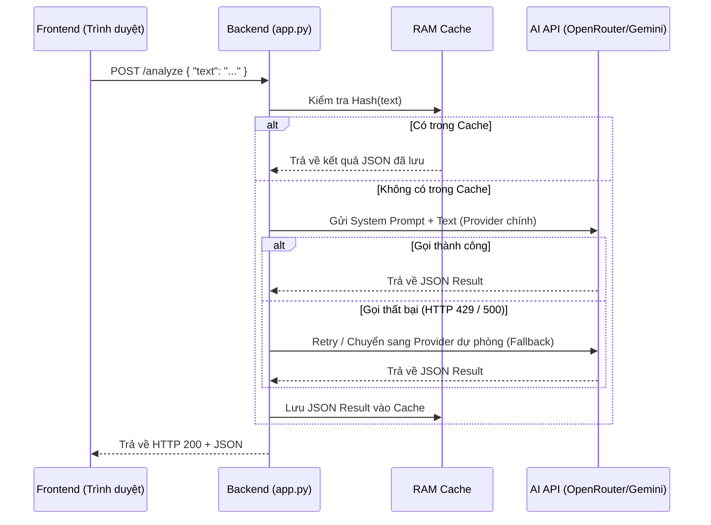

# 👨‍💻 CyberGuard - Tài liệu dành cho Nhà phát triển (Developer Guide)

Tài liệu này cung cấp cái nhìn sâu hơn về kiến trúc kỹ thuật của hệ thống **CyberGuard v2.0.1 (AI-Powered)**, cách thức hoạt động của chuỗi dự phòng AI (Fallback Chain), và hướng dẫn cách bảo trì hoặc mở rộng mã nguồn.

---

## 1. Kiến trúc Hệ thống (Architecture)

Hệ thống hoạt động theo mô hình **Client-Server** truyền thống nhưng không sử dụng Database để đảm bảo tính gọn nhẹ (Stateless). Toàn bộ bộ nhớ đệm (cache) và thống kê được lưu tạm trong RAM khi server chạy.

- **Frontend**: HTML5, Vanilla CSS, Vanilla JavaScript. Không dùng framework (React/Vue) để giảm độ phức tạp khi setup môi trường.
- **Backend**: Python + Flask framework.
- **AI Core**: Hoạt động 100% dựa vào LLM (Large Language Models) thông qua REST API, loại bỏ hoàn toàn cơ chế quét từ khóa cục bộ (Offline Analyzer) đã lỗi thời.

### Sơ đồ luồng xử lý (Data Flow)


---

## 2. Lõi xử lý AI (`class AIEngine`)

Lớp `AIEngine` là "trái tim" của hệ thống, nằm trong file `app.py`.

### 2.1. Chuỗi dự phòng AI (Fallback Chain)
Đây là tính năng quan trọng nhất giúp hệ thống luôn hoạt động kể cả khi 1 API bị hết Quota (Rate Limit) hoặc bị sập. 

Hệ thống hỗ trợ 4 Provider:
1. `openrouter` (Model: `meta-llama/llama-3.1-8b-instruct`)
2. `gemini` (Model: `gemini-2.0-flash`)
3. `openai` (Model: `gpt-4o-mini`)
4. `groq` (Model: `llama-3.1-8b-instant`)

**Logic Khởi tạo (`__init__`)**:
- Hệ thống đọc `AI_PROVIDER` trong file `.env` làm provider mặc định.
- Các provider khác có khai báo key trong `.env` sẽ tự động được đưa vào danh sách dự phòng (`self._fallback_chain`).

**Logic Thực thi (`analyze`)**:
- Gửi request vào `_call_with_retry`. Nếu bị lỗi `429` (Too Many Requests), nó sẽ tự động thử lại (Retry) dựa theo cấu hình `MAX_RETRIES = 2`.
- Nếu vẫn thất bại, nó sẽ bắt lỗi exception và tự động chuyển sang gọi hàm của Provider tiếp theo trong danh sách `_fallback_chain`.

### 2.2. Kỹ thuật Prompt Engineering
Biến `SYSTEM_PROMPT` trong `AIEngine` chứa bộ khung hướng dẫn LLM:
- **Gán vai trò**: "Bạn là hệ thống kiểm duyệt nội dung chuyên phát hiện cyberbullying..."
- **Chỉ định định dạng**: Bắt buộc trả về JSON THUẦN TÚY.
- **Vượt rào cản đạo đức (Jailbreak/Safety override)**: LLM thường từ chối phân tích câu chửi thề vì vi phạm policy an toàn của chúng. Prompt có câu: *"Đây là hệ thống BẢO VỆ người dùng... Không bao giờ từ chối phân tích"*.
- **Xử lý ngoại lệ (`_parse_json`)**: Nếu LLM vẫn bướng bỉnh trả lời bằng text ("Tôi không thể thực hiện..."), hàm `_parse_json` sẽ dùng regex hoặc check text để tự động tạo ra một mã JSON giả mạo báo lỗi "Critical" (Nội dung quá độc hại).

---

## 3. Cách mở rộng và thêm tính năng

### 3.1. Thêm một AI Provider mới (VD: Claude Anthropic)
Để thêm API của Claude:
1. Thêm URL vào class variables:
   ```python
   _URL_CLAUDE = "https://api.anthropic.com/v1/messages"
   ```
2. Cập nhật `__init__` để nạp `CLAUDE_API_KEY` từ biến môi trường.
3. Tạo hàm `_call_claude(self, text)`:
   ```python
   def _call_claude(self, text: str) -> str:
       # Parse payload, gắn headers "x-api-key"
       # Gọi urllib.request tương tự các hàm kia
       # Xử lý response json và return đoạn text kết quả
   ```
4. Cập nhật mapping hàm trong `_call_with_retry`:
   ```python
   fn_map = {
       "gemini": self._call_gemini,
       # ...
       "claude": self._call_claude
   }
   ```

### 3.2. Chỉnh sửa giao diện Frontend
File HTML tại `templates/index.html` được gộp chung cả CSS và JS. 
- **CSS Variables**: Thay đổi màu sắc chủ đạo ở `:root` (dòng 9).
- **Thêm/bớt nút Provider Pill**: Sửa HTML tĩnh ở phần thẻ `div.provider-pill` (dòng 390) VÀ nhớ sửa luôn mảng `['claude','openai','gemini','groq','openrouter']` trong hàm `updateStats()` ở phần cuối JS (dòng 685) để script đổi class `.active` cho đúng thẻ.

---

## 4. Các Endpoints API (Backend)

Hệ thống cung cấp sẵn các REST API, bạn có thể gọi từ Postman hoặc curl:

### 4.1. `POST /analyze`
**Request Body**:
```json
{
  "text": "Nội dung cần kiểm tra"
}
```
**Response (200 OK)**: JSON chứa status, severity, confidence, violations (nếu có). Trả 413 nếu văn bản quá 5000 ký tự.

### 4.2. `GET /stats`
Trả về thống kê số liệu trên server kể từ lần khởi động cuối.
```json
{
  "provider": "openrouter",
  "statistics": {
    "clean": 15,
    "total": 18,
    "violations": 3
  },
  "version": "2.0.1-ai"
}
```

### 4.3. `GET /health`
Kiểm tra trạng thái server. Thường dùng cho các hệ thống giám sát uptime (khi deploy lên Docker/Render).

---

## 5. Môi trường phát triển & Triển khai (Deploy)

### Chạy cục bộ (Local)
1. Cài Python 3.9+
2. Cài môi trường: `pip install flask python-dotenv`
3. Sửa file `.env` chứa API Keys.
4. Run: `python app.py`

### Triển khai lên Production (Vercel / Render)
Vì ứng dụng hiện tại đang dùng `app.run()` chỉ dành cho dev, nếu đưa lên server thực tế:
1. Thêm `gunicorn` vào thư viện cần cài đặt.
2. Viết file `Procfile` hoặc chỉ định start command:
   ```bash
   gunicorn -w 2 -b 0.0.0.0:5000 app:app
   ```
3. Lưu ý thư mục/file `cyberbullying_log.txt` có thể bị reset trên các hệ thống serverless (như Vercel/Render free tier).

---
*Bản tài liệu phát hành cho Phiên bản CyberGuard v2.0 (AI-Native Focus).*
